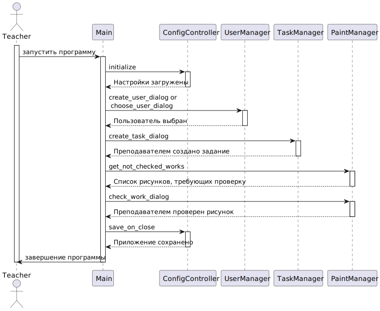

## Draw learning helper

Программа, которая поможет автоматизировать часть процессов в обучении студентов,
отрабатывающих навыки рисования. Она представляет собой готовую консольную программу. Но ее также
можно интегрировать в другие системы.

Ключевыми особенностями программы являются:
- валидация сдаваемой работы путем сравнения созданного рисунка с текстовым описанием задания;
- проверка уникальности работы;
- система поиска рисунков по изображению.

То есть для каждой работы студента преподаватель видит, соответствуют ли работа заданию
и не является ли работа плагиатом, что упрощает проверку работ.

Также программа включает в себя:
- создание пользователей;
- добавление заданий для студентов;
- загрузка изображений для выполнения заданий;
- просмотр своих и чужих работ;
- интерфейсы для проверки задания преподавателем и исправления студентом;
- инкапсуляцию работы программы со своими данными, и потенциальным GUI и WEB интерфейсам будет не обязательно вникать в детали хранения данных.

## Как установить

Загрузить библиотеку:

```
git clone https://github.com/lruns/draw-learning-helper.git
cd draw-learning-helper
```

При желании можно установить библиотеку в отдельном виртуальном окружении:
```
python3 -m venv venv
# On linux
. venv/bin/activate
# On Windows
.\venv\Scripts\activate
```

Установка библиотеки:

_Для Windows убедитесь, что установленные pip пакеты добавлены в
Переменные среды и доступны из консоли._
```
pip install .
```

После этого можно запустить ее в консоли:
```
draw-learning-helper
```

## Как использовать

При запуске программы, будет предложено создание папки, где будут храниться все рисунки и настройки.
Можно использовать папку по умолчанию `~/Draw learning helper` или новую папку.
Можно также указать существующую папку, если Вы уже ранее пользовались программой.
Местоположение папки хранится в файле с названием `~/Draw learning helper/draw_learning_helper_config.json`.

Для ознакомления с программой можете использовать папку `./project_example`

Если не существует ни одного пользователя, программа предложит создать нового. После этого можно будет
выбрать созданного пользователя (аккаунт студента или преподавателя) или создать ещё нового.

После выбора пользователя можно будет в любой момент выйти из программы, набрав `quit` или `q`.
Или выбрать/создать другого пользователя, набрав `user` или `u`.


В зависимости от выбранного пользователя (студент или преподаватель) существует разный набор функций:
- Для студентов:
  1. Загрузить изображение для задания
  2. Просмотреть свои работы
  3. Просмотреть работы других студентов
  4. Просмотреть проверки от преподавателя
- Для преподавателей:
  1. Создать новое задание
  2. Просмотреть требующие проверку работы студентов

Для начала преподавателю нужно будет создать задание, чтобы студенты могли загрузить свои работы. После
этого преподаватель сможет посмотреть требующие проверку работы студентов и принять или отклонить их
с написанием комментария. Студент сможет позже посмотреть проверки от преподавателя и загрузить 
исправленный вариант для задания.


## Скриншоты работы программы
___

___

___

___

___

___

## Структура и работа программы
### Классовая диаграмма


Сгенерировано с помощью `pyreverse`:
```
pip install pylint
pyreverse -o plantuml .\src\
```
### Диаграммы последовательности для студента и преподавателя

